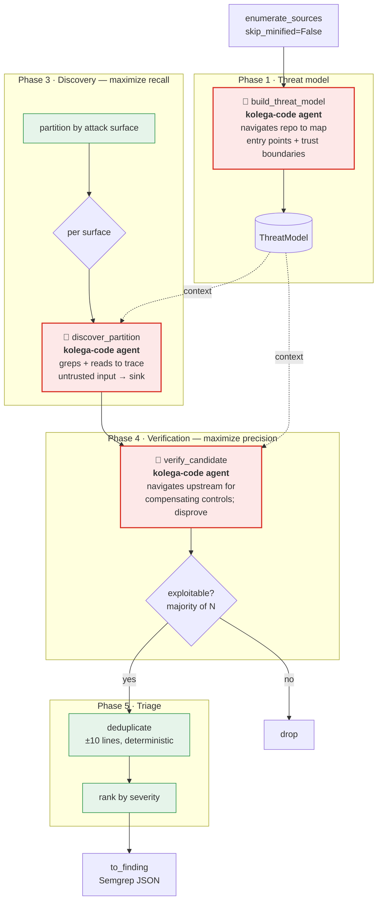

# `kolega-scan-oss-ref` — Architecture

> Precision-first by design: an adversarial verifier and no sandbox PoC keep
> false positives low, which trades away some recall.

An LLM-driven adaptation of Anthropic's
[*Using LLMs to secure source code*](https://claude.com/blog/using-llms-to-secure-source-code)
six-phase find-and-fix loop, implemented as a `ScanProvider`. This pipeline powers the
shipped versions `kolega-scan-oss-v1` (**default**, 2-model DeepSeek flash+pro) and
`kolega-scan-oss-v2` (3-model, adds Kimi); `kolega-scan-oss-ref` is its single-model
reference form. `--scanner detectors` is the deterministic fallback.

## Pipeline



🤖 **red = `kolega-code` agentic loop** (tool-using, navigates code on demand).
🟢 green = deterministic Python (no model). Today these three nodes are single-shot
`chat_json` calls with pre-stuffed, truncated context — **the agentic upgrade replaces
each with a `kolega-code` session** so the model retrieves what it needs instead.

## Agentic upgrade — `kolega-code` injection points

`kolega-code` is given a read-only toolset (`grep`, `glob`, `read_file`, `list_dir`) scoped
to the repo and a task prompt; it loops tool-call → observe → reason until it emits the
phase's structured JSON. Three injection points, one per LLM node above:

### ① Threat model (`threat_model.py`)
**Why:** today we paste a fixed file-tree + a few entry files. Agent instead explores.
**Loop:** `glob("**/urls.py|**/routes*|**/app.py") → read_file → grep("@login_required|Depends|permission_classes")` → emit `ThreatModel`.
```jsonc
// tool trace (abridged) → final output unchanged shape, better grounded
{"tool":"grep","args":{"q":"@app.route|@router|class .*View"}}
{"tool":"read_file","args":{"path":"api/auth.py"}}
→ {"summary":"FastAPI lending API; JWT-gated except /public/*",
   "trust_boundaries":["anon→/auth","user→/loans (owner-scoped)","user→admin /ops"],
   "trusted_inputs":["internal service JWT"], "vuln_classes":["idor","missing_authz","ssrf"]}
```

### ② Discovery (`discovery.py`) — the big recall lever
**Why:** today each finding is limited to a ≤12-file / 4k-char-per-file partition; cross-file
flows and file tails are invisible. Agent follows the data flow across files.
**Loop:** seeded with one attack surface → `grep` the sink → `read_file` the handler →
follow imports/helpers across files → confirm reachability → emit candidates.
```jsonc
{"tool":"grep","args":{"q":"execute\\(|raw\\(|cursor\\."}}            // find sinks
{"tool":"read_file","args":{"path":"loans/views.py","lines":"40-80"}}
{"tool":"grep","args":{"q":"def get_loan|loan_id"}}                   // trace the id
→ {"findings":[{"vuln_class":"idor","file":"loans/views.py","line":58,
     "rationale":"loan_id from path → Loan.objects.get(id=loan_id), no owner filter; "
                 "ownership helper require_owner() exists in perms.py but is NOT called here",
     "cwe":"CWE-639","severity":"high","confidence":"high"}]}
```
This is the cross-file reasoning the chunked version structurally cannot do (it scored
missing-authorization bugs get missed precisely because the guard lives in a different file).

### ③ Verification (`verification.py`)
**Why:** today the verifier sees only a ±40-line window — it can't *find* a control it
wasn't handed, so it disproves-by-default and kills true positives.
Agent goes looking for the compensating control before ruling.
**Loop:** `grep` for middleware/decorators/validation on the route → `read_file` the
helper → rule.
```jsonc
{"tool":"grep","args":{"q":"before_request|middleware|require_owner|clean\\("}}
{"tool":"read_file","args":{"path":"perms.py"}}
→ {"exploitable":true,"severity":"high",
   "reason":"require_owner() defined but never imported in loans/views.py; no middleware "
            "covers /loans/<id>; path is anon-after-login reachable → IDOR confirmed"}
```

### Phase 5 stays deterministic
Dedup/rank remain plain Python. Optional future: a `kolega-code` pass for **cross-file
root-cause** dedup (one missing global guard surfacing as N findings) — not required for v2.

**Interface:** each agent still returns the *same* phase JSON the current nodes return, so
`provider.py`'s orchestration, `models.py`, and `findings.py` are unchanged. The swap is
local to the three phase modules — replace the single `chat_json` call with a
`kolega_code.run(task, tools, schema)` session that yields the identical structured object.

## Modules

| File | Phase | Responsibility |
|---|---|---|
| `provider.py` | orchestration | Runs the loop; requires an LLM (no silent fallback) |
| `threat_model.py` | 1 | Code-derived threat model (human interview omitted — CLI is non-interactive) |
| `partition.py` | 3a | Partition by attack surface; pick entry-point files for Phase 1 |
| `discovery.py` | 3b | One structured discovery pass per partition; defensive parse, line-clamp |
| `verification.py` | 4 | Independent, adversarial verifier; strict-majority vote |
| `triage.py` | 5 | Deterministic dedupe + severity rank |
| `findings.py` | — | Candidate → `Finding` (CWE sanitized, verifier severity wins) |
| `prompts.py` · `coderender.py` · `models.py` · `config.py` | — | Prompts, line-numbered rendering, dataclasses, budgets |

## Intentional omissions vs. the article

- **Phase 2 (sandbox / PoC execution)** — N/A in a findings-only CLI. Verification is
  code-analysis only (the article permits this at lower precision). This is *the* reason
  recall is low: the verifier disproves-by-default with no PoC to confirm borderline bugs.
- **Phase 6 (patching / variant search)** — out of scope for a scanner that emits findings.
- **Human interview (Phase 1)** — omitted; the CLI is non-interactive.

## Key design choices

- **Threat model injected into discovery + verification** — the article's main false-positive
  lever ("threat model grounding").
- **Independence in Phase 4** — the verifier sees only the finding + code, never the discovery
  reasoning, so it cannot rubber-stamp its own work.
- **Deterministic Phase 5** — zero LLM cost; model-based dedup qualification is future work.
